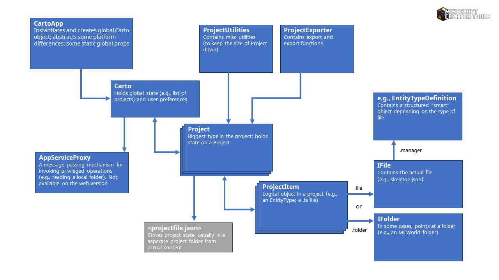
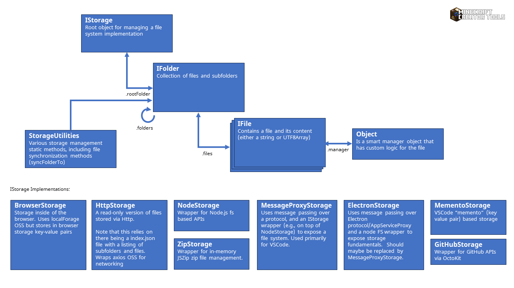
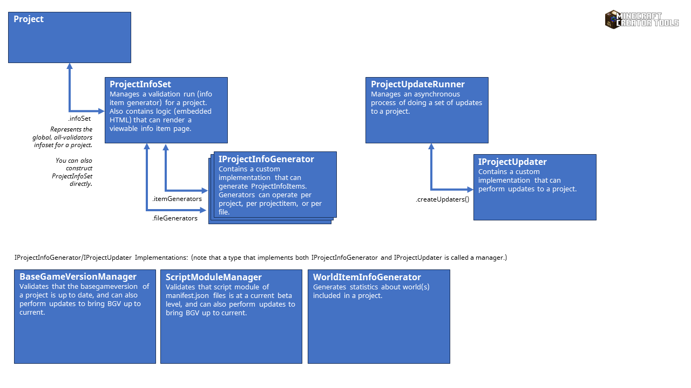
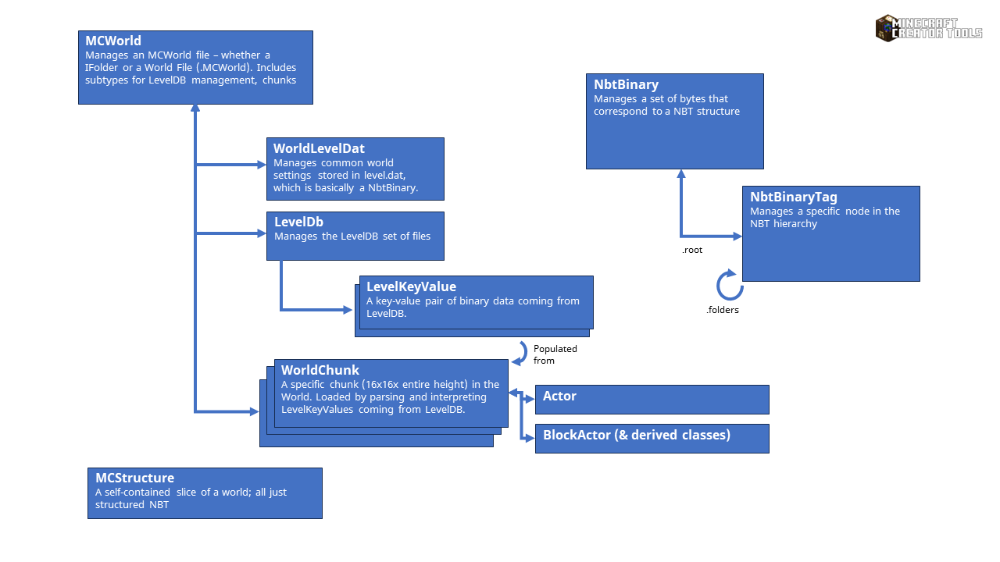

# Project Structure

Most logic source is located under the /app folder. This application compiles to a web app (`npm run web` and/or `gulp webbuild`) and as NodeJS-compatible libraries (`gulp jsncorebuild`). Also, there is a small suite of tests (`npm run test`).  

## Core Types: Carto, Project, and ProjectItem

### Carto

Carto is the main "global object" of the project. Carto should be generally insulated from the details of the platform/form factor it is loaded within.

It:

* contains persisted preferences from the user, stored via the ICartoData interface
* Has IStorage objects that represent where preferences are stored (`prefsStorage`), where new projects are stored (`projectsStorage`), deployment storage (in the app version, this is the Minecraft target folder), where worlds are stored (in the app version, this is the minecraftWorlds folder.)
* has a `loadGallery` function which is where it loads the "gallery" (`IGallery`) of potential starter projects and project items.

### CartoApp

CartoApp represents the application, and attempts to abstract the differences away between the different platforms. It has thunk functions to perform platform-specific operations.

It:

* has the CartoApp.hostType property (and derived methods like .isWeb or .isNodeJs), which is the source of a lot of per-platform special casing

### Project

The Project object is likely the biggest type by code volume in the project. It contains all of the logic for managing a "project". Over time, code has been trying to be moved out from Project into mostly-static-member classes like `ProjectUtilities`, `ProjectTools`, and `ProjectExporter`.

One of the main centerpieces of Project is `_inferProjectItemsFromFolder`, which is a monster recursive function that attempts to identify and ensure ProjectItems based on the type of file it discovers in a folder (e.g., a JSON file in an `/items/`` folder in a behavior pack is a ProjectItem of type itemTypeBehaviorJson)

It:

* has a list of project meta preferences (`IProjectData`) that are stored in a JSON file. Typically, Carto manages a folder per-project with this JSON file in an out-of-the-way directory.

### ProjectItem

The project item represents a single logical "atom" object of the project - e.g., a behavior pack entity type definition or a single .TS file. It uses IProjectItemData - which is typically saved in the parent project's JSON preferences file. Project Items are identified by their canonicalized `storagePath` which should be relative to the root of a Project.  

A project item is typically associated with an IFile (in some limited cases, it points at a Folder, e.g., in the case of a World). IFiles have a .manager generic Object property. Typically, ProjectItem uses this dummy property to store a per-file manager - e.g., an EntityTypeDefinition object is stored on the IFile for an entity type definition (e.g., skeleton.json) which has the actual logic for managing an entity type definition.

## File System Abstractions

The app/src/storage folder contains a file system abstraction that corresponds to a standard concept of folders and files. The API is fairly asynchronous (e.g., folders should be asynchronously .load ed before use).

Files and folders have a simple tag-style property (.manager) which is holder for an object that has extended logic for managing the contents of a file.

There are several implementations of the file system abstraction:

* BrowserStorage: Implements local storage within browsers by wrapping localForage APIs which in-turn wrap browser-standard key-value pair storage APIs.
* HttpStorage: Implements read-only storage based on files on the web.
* NodeStorage: Implements storage on top of NodeJS `fs` API primitives.
* GitHubStorage: Provides read-only, non-authenticated access to GitHub repos via OctoKit APIs and raw HTTP downloads of binaries. Note that there is a writeable, authenticated implementation but that has atrophied and needs a server-side service element component for managing tokens.

## Validation & Project Updating

Validation and project updates/fix-ups are wrapped by the `ProjectInfoSet` object. There is an interface for `IProjectInfoGenerator` for "information generator" types that can provide groups of different info item objects (errors, warnings, recommendations, and pure informational items.) These info items can be aggregated to provide statistics across projects. Also, for certain kinds of errors (e.g., out-of-date script beta module versions), InfoGenerators can also provide an "updater" which can make changes to a project (e.g., update script beta module versions to the latest.)

We have a growing catalog of info generator/updaters (an info generator + an updater combo is called a 'manager'):

* BaseGameVersionManager. Scans for out-of-date base game versions and can update it to the latest Minecraft team.
BehaviorPackEntityTypeManager. Can scan and ensure the health of behavior pack entity types (in particular, ensure that format version is up to date.)
* ScriptModuleManager. Ensures that script modules are up to date.
* BehaviorPackEntityTypeManager. Managings behavior pack entity type files (mostly just checking format_version for now.)  Ideally, this type would, for example, be able to do "smart" format version upgrades to maintain semantic compatibility as it upgrades.
* SchemaItemInfoGenerator. Wraps the process of using JSON schemas to produce validation information on JSON files.

## Worlds

World code starts with a foundation of NBT parsing, which is needed for understanding level.dat. NBT is a proprietary Minecraft format that basically represents a hierarchical tree structure for typed data. The implementation here focuses on [`NbtBinary.ts`](./app/src/minecraft/NbtBinary.ts) and [`NbtBinaryTag.ts`](./app/src/minecraft/NbtBinaryTag.ts). MCStructure files - small snapshots of a portion of the world - are also based on some level of NBT parsing. Above this, we have some basic script-based code for parsing level DB files, based on the [level DB spec](https://github.com/google/leveldb). This loads a number of LevelKeyValue pair objects. Most LevelKeyValue pair objects, by quantity, tend to be tied into a specific chunk or subchunk, so when parsing a world the WorldLevelChunk object becomes a focal point for understanding and unifying the actual data of a world.

## UX

UX is all React-based for the web. By convention we use the older-style markup of TSX files vs. the alternate functional style of React. We use the Monaco OSS engine for code editing. OSS FluentUI-react northstar is used for the UX fundamentals. The one bit of abstraction built into this project is DataForm, which provides Form-esque support for editing of JSON-based structures.
